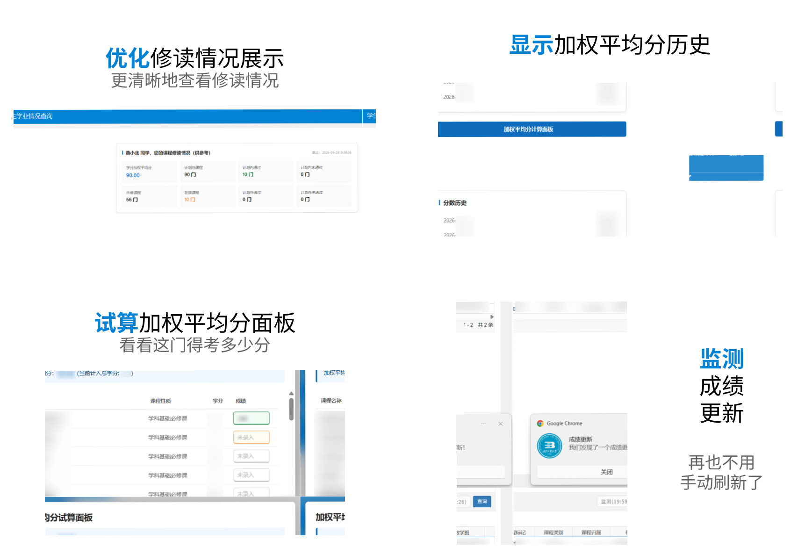

<div align=center>
<h2>Advanced-BJUT-Online</h2>
<b>更好的北京工业大学教务 / 门户使用体验</b>
<br/>
<br/>
<i>包括...</i>
</div>




<div align=center>
<i>以及</i>
<p>
隐藏教务系统首页照片<br/>
优化门户网站左下角工具区域排列顺序<br/>
隐藏教务系统顶部 Tips 提示条<br/>
教务系统个人信息页表格可拖拽调整高度<br/>
WebVPN 会话 Cookies 持久化 <sup>Tampermonkey BETA 有效</sup>
</p>
</div>

### 安装

若您已经安装了 Tampermonkey（油猴 / 篡改猴）插件，请点击该 [**链接**](https://cdn.jsdelivr.net/gh/DeepslateBricks/Advanced-BJUT-Online/advanced-bjut-online.js) 添加此脚本。

若您还未安装上述插件，请使用该提示词询问 AI 如何安装：

```
请告诉我如何在我的浏览器上安装 Tampermonkey 插件。我的浏览器是 [浏览器名称]、系统为 [系统名称]。
在安装完成后，我希望添加脚本：https://cdn.jsdelivr.net/gh/DeepslateBricks/Advanced-BJUT-Online/advanced-bjut-online.js
```

### 声明

若该工具违反了学校相关规定，请您通过 Issues 等方式联系我。我会在收到通知的第一时间，即刻下架相关工具或删除相关内容。

本项目为作者个人利用业余时间开发的技术交流与分享项目。本项目非学校官方授权、非官方组织开发，其所有代码及功能均不代表学校的任何官方立场。