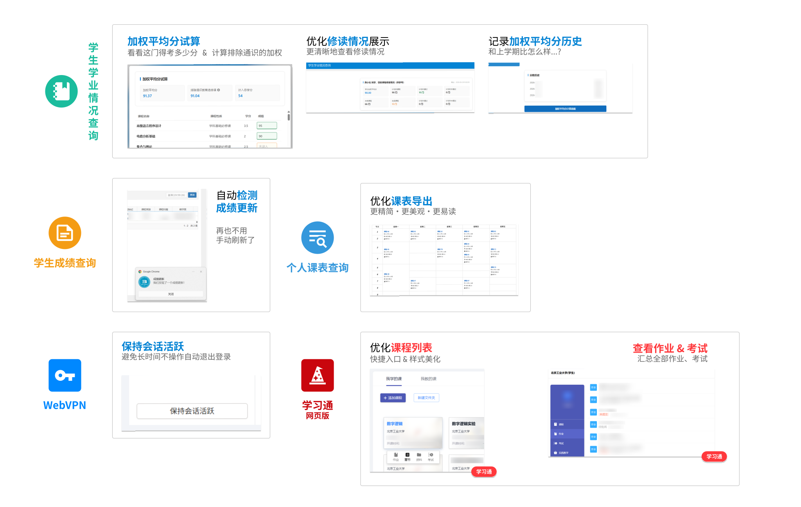

   <h2>Advanced-BJUT-Online</h2>
   <b>更好的北京工业大学教务 / 门户使用体验</b>
    

### 安装

若您已经安装了 Tampermonkey（油猴 / 篡改猴）插件，请点击该 [**链接**](https://cdn.jsdelivr.net/gh/DeepslateBricks/Advanced-BJUT-Online/advanced-bjut-online.js) 添加此脚本。

若您还未安装上述插件，请使用该提示词询问 AI 如何安装：

<pre class="click-to-copy"><code>请告诉我如何在我的浏览器上安装 Tampermonkey 插件。我的浏览器是 [浏览器名称]、系统为 [系统名称]。
在安装 Tampermonkey 完成后，我希望添加脚本 Advanced BJUT Online，URL 为：https://cdn.jsdelivr.net/gh/DeepslateBricks/Advanced-BJUT-Online/advanced-bjut-online.js
</code></pre>

如果您喜欢这个工具的话，欢迎 Star <b><a href="https://github.com/DeepslateBricks/Advanced-BJUT-Online" target="_blank">GitHub 仓库</a></b> 支持我们~

### 主要功能介绍

1. ***教务系统*** - **学生学业情况查询**  
   - **优化修读情况展示**：自动将 <u>页面顶部</u> 的修读情况（加权平均分、修读课程数等）信息整理为表格卡片；
   - **显示加权平均分历史**：记录加权平均分变化，并 <u>在页面底部显示</u>；
   - **试算加权平均分面板**：<u>在页面底部点击入口进入</u>，可以编辑每门课程的课程得分、查看在该得分下自己的加权平均分会是多少。其中绿色表示已经出分的课程，黄色表示已修读但还未出分的课程；同时还可以查看去除通识教育选修课后的加权平均分。

2. ***教务系统*** - **学生成绩查询**
   - **监听成绩更新**：<u>点击查询按钮左侧的监测按钮</u> 可以自动检测成绩更新，在成绩更新时自动通过系统通知的方式提示；

3. ***教务系统*** - **个人课表查询**
   - **隐藏无课程的天**：<u>勾选顶部左侧“隐藏无课程的天”复选框</u> 以启用。开启后例如周六、日没有课程安排，则会自动隐藏课表中周六、日两天的列；
   - **更好的课表导出**：<u>点击顶部右侧“打印”按钮</u> 可以打印 / 导出更加简洁、美观、易于阅读的课表。

4. ***WebVPN*** - **首页**
   - **保持会话活跃**：<u>点击左下角的“保持会话活跃”按钮</u> 可以避免长时间无操作导致自动退出登录。点击按钮后请不要关闭这个页面。

5. ***学习通*** - **个人主页**
   - **查看作业 / 考试**：点击侧栏“作业”、“考试”入口可以查看自己的全部作业、考试；
   - **课程列表优化**：优化课程列表的样式，并添加快捷进入课程作业、章节等模块的按钮。

### 声明

若该工具违反了学校相关规定，请您通过 Issues 等方式联系我。我会在收到通知的第一时间=下架相关工具或删除相关内容。

本项目为作者个人利用业余时间开发的技术交流与分享项目。本项目非学校官方授权、非官方组织开发，其所有代码及功能均不代表学校的任何官方立场。
